# Naughty Cat 
## CTFlearn
Naughty Cat Writeup

* **Category:** Forensics
* **Points:** 50
* **level:** Medium

## [Challenge](https://ctflearn.com/challenge/890)

> Think the flag is somewhere in there. Would you help me find it?\
> https://ctflearn.com/challenge/download/890

## Solution

The solution is fairly lenghty.
First we use **binwalk** to detect the hidden files 

```
binwalk cut3_c4t.png
```
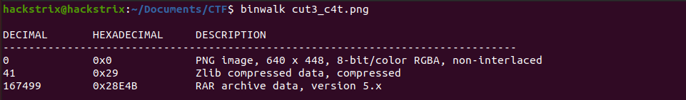

we get some file here, now lets extract those files

```
binwalk --dd='.*' cut3_c4t.png
```
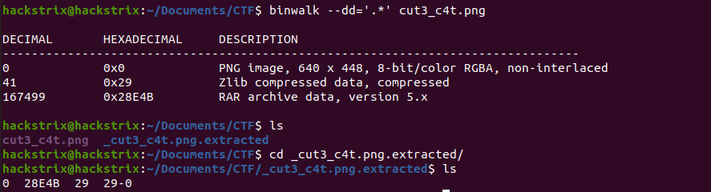

we get 3 files here, lets detect these file types using **file**

```
file *
```
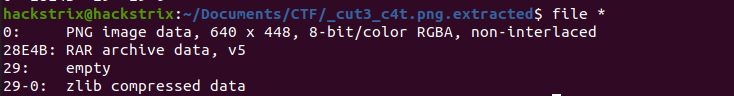

we see here a rar file, let extract it...

```
unrar x 28E4B
```
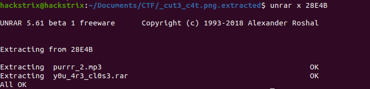

here we got two more files , lets try using file on these
```
file y0u_4r3_cl0s3.rar purrr_2.mp3
```
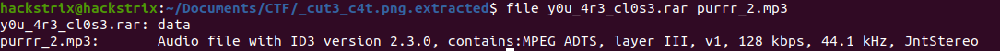
we can see here that the rar file is only showing as data which means it is corrupted.

When we see its hex in hexedit we see that the hex header is wrong 
and change it to its correct value **52 61 72 21 1A 07 01 00**
```
hexedit y0u_4r3_cl0s3.rar
```
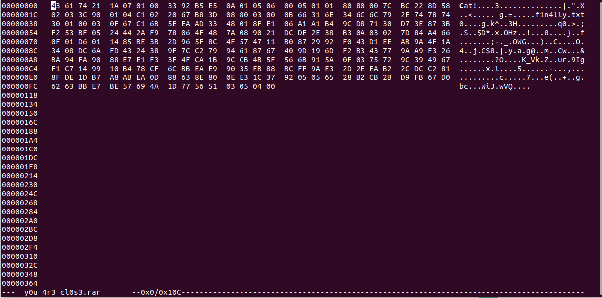
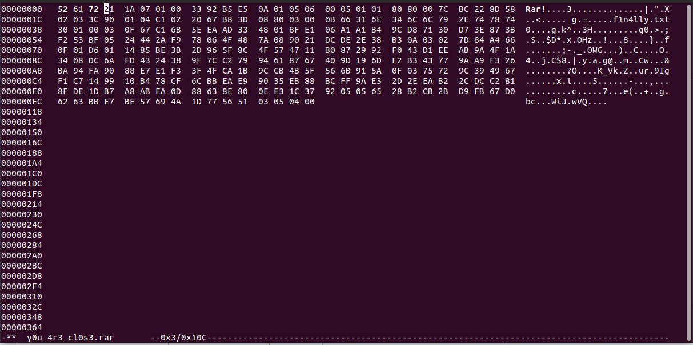

now after using files we see that the file is showing correctly, so we try extracting it .....

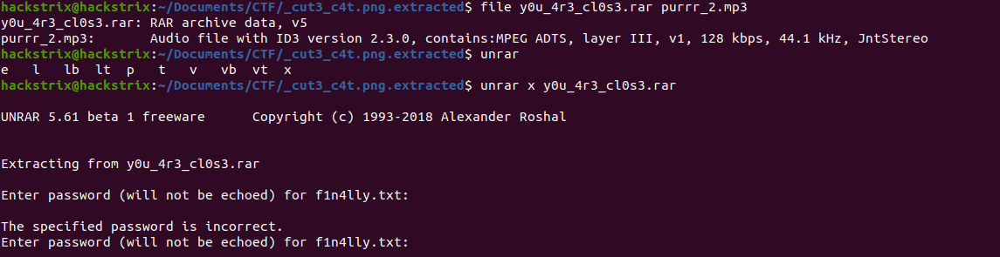

**But now it start asking for password.**
To find the password we use **audio visualizer on 'purrr_2.mp3' in spectogram mode.** I used audacity and we get the password **sp3ctrum_1s_y0ur_fr13nd**

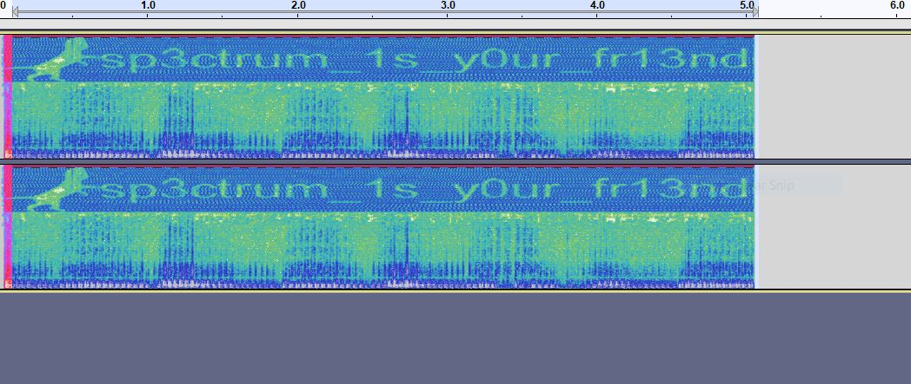

```
unrar x y0u_4r3_cl0s3.rar 
```
using password **sp3ctrum_1s_y0ur_fr13nd**

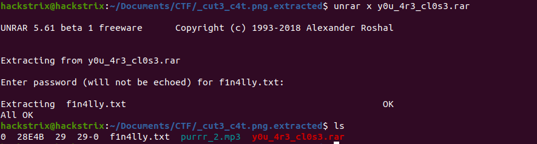

here we get a file **f1n4lly.txt**. Now we cat the file to get some encrpted text.
```
cat f1n4lly.txt
```

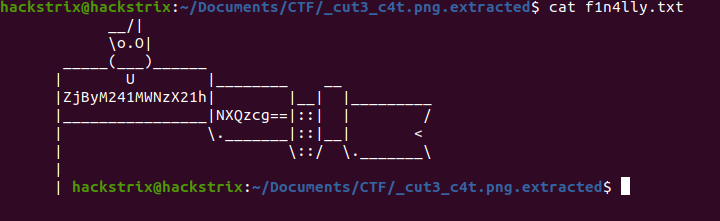

**ZjByM241MWNzX21hNXQzcg==**

Here we notice that the encrpted text have two **equalto(==)** signs at the end so we try decrpting it with base64 online.

https://www.base64decode.org/ 

after decypting we get the flag as

### **FLAG** 
```f0r3n51cs_ma5t3r```
